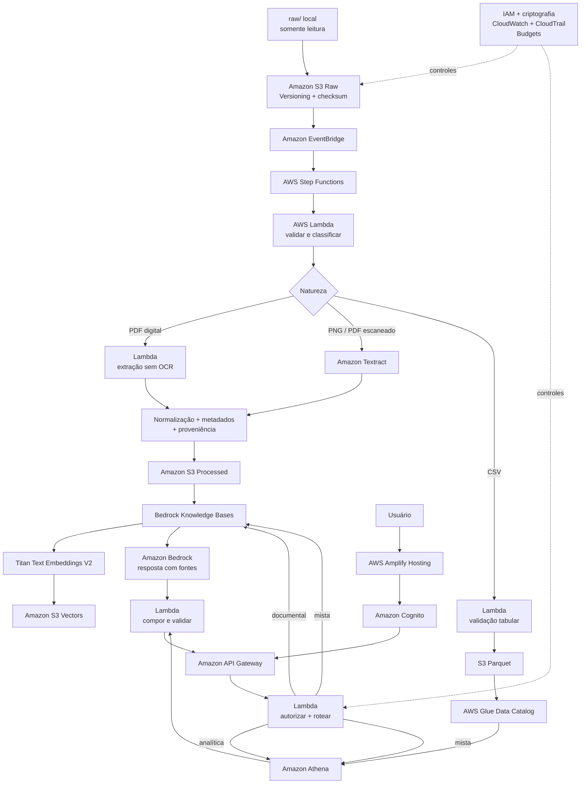

# Wiki Corporativa Inteligente com AWS

Proposta de arquitetura para transformar documentos corporativos heterogêneos em conhecimento pesquisável, rastreável e seguro usando exclusivamente serviços AWS.

O projeto parte de três fontes reais do laboratório — um PDF digital, uma ata digitalizada em PNG e uma exportação CSV de CRM — e demonstra por que cada formato exige um pipeline diferente. A solução combina RAG para conhecimento documental com SQL determinístico para dados estruturados.

> **Estado final em 23/08/2026:** discovery, desenho, POC AWS controlada, cleanup e revisão Guardião concluídos. A POC real em `us-east-1` preservou os três originais, executou uma página Textract, indexou dois documentos em Bedrock Knowledge Bases com S3 Vectors e realizou consultas limitadas. Todos os recursos persistentes inventariados foram removidos e a ausência foi verificada. O Cost Explorer não havia consolidado dados para o período consultado; custo observado não foi tratado como zero.

## Visão executiva

O problema não é apenas armazenar arquivos. É preservar o original, extrair informação sem perder estrutura, distinguir evidência de inferência e responder perguntas com fontes verificáveis.

A arquitetura proposta segue quatro princípios:

1. **Tratar cada formato pela sua natureza:** PDF digital sem OCR, PNG com Amazon Textract e CSV como tabela.
2. **Preservar e rastrear:** cada derivado aponta para o objeto S3 original, sua versão e checksum.
3. **Separar semântica de cálculo:** atas usam RAG; agregações do CRM usam AWS Glue e Amazon Athena.
4. **Não responder sem evidência:** ausência, conflito, baixa confiança ou falta de autorização resultam em resposta limitada ou revisão humana.

## Acervo analisado

Os três arquivos estão diretamente em `raw/`, que permanece somente leitura.

| Arquivo | Natureza observada | Conteúdo e desafio principal | Tratamento proposto |
|---|---|---|---|
| `ata_reuniao_vendas_sa.pdf` | PDF digital, 5 páginas, camada textual | Tabelas, 5 decisões, 6 ações, 4 riscos e continuidade entre páginas | Extração direta em Lambda, sem OCR; preservar página, seção e relações tabulares |
| `ata_resultados_vendas_novos_dados.png` | Imagem digitalizada, 1900 × 2700 pixels | Tabela, ruído, inclinação e handwriting: “conferir CRM” e “ação prioritária” | Amazon Textract para texto, tabela, geometria, handwriting e confiança |
| `vendas_sa_dados_ficticios_laboratorio.csv` | CSV UTF-8 com BOM, 240 registros e 19 colunas | Datas, categorias, percentuais, valores e vazios dependentes do status | Validar tipos, preservar estrutura e consultar com Glue/Athena; não converter cegamente em texto para RAG |

O inventário factual completo, incluindo hashes SHA-256, está em [`docs/ACERVO.md`](docs/ACERVO.md).

## Arquitetura proposta



O diagrama detalhado e seus limites estão em [`diagrams/architecture.md`](diagrams/architecture.md).

## Fluxo de ponta a ponta

### 1. Ingestão e preservação

- Upload autenticado para um bucket S3 privado e versionado.
- `document_id` derivado do SHA-256 para deduplicação e correlação.
- Manifesto com nome original, chave, `version_id`, checksum, MIME, timestamps e estado.
- S3 Block Public Access, TLS e criptografia em repouso.
- Original nunca é movido ou alterado pelo pipeline.

### 2. Classificação e processamento

- EventBridge inicia a Step Functions após criação do objeto.
- Lambda compara assinatura binária, extensão, MIME, camada textual e esquema.
- PDF digital: extração direta, evitando custo e erro de OCR.
- PNG/PDF escaneado: Textract preserva blocos, tabelas, geometria e confiança.
- CSV: validação das 19 colunas, tipos e regras dependentes do status; saída opcional em Parquet.
- Falhas definitivas geram quarentena lógica e manifesto de erro sem alterar o original.

### 3. Normalização e metadados

Documentos recebem um contrato JSON versionado com:

- `document_id`, `source_uri`, `source_version_id` e checksum;
- tipo, data, tema, participantes, decisões, responsáveis, ações, prazos e riscos;
- página, bloco ou região visual que sustenta cada campo;
- `confidence` por campo/bloco;
- proveniência: `observed`, `deterministic_derived`, `ai_inferred` ou `human_validated`;
- timestamps e versão do esquema.

S3 mantém o conteúdo e o histórico completos. DynamoDB é opcional para estado e filtros de baixa latência. Glue Data Catalog descreve o CRM validado/Parquet.

### 4. Indexação documental

- Chunking respeita seções, decisões, ações, riscos e tabelas.
- Baseline de 300–500 tokens, com pequena sobreposição apenas em texto contíguo; parâmetros devem ser calibrados por avaliação.
- Amazon Bedrock Knowledge Bases sincroniza somente documentos aprovados.
- Titan Text Embeddings V2 é o candidato inicial para embeddings em português.
- S3 Vectors é a primeira opção de vector store para baixa frequência e operação sem cluster.

S3 Vectors oferece busca semântica, não busca híbrida nativa nessa integração. IDs exatos usam filtros/busca operacional; OpenSearch Serverless só seria adotado se medições justificarem busca híbrida, facetas, QPS ou latência adicionais.

### 5. Consulta híbrida de aplicação

| Tipo de pergunta | Rota | Fonte da resposta |
|---|---|---|
| Decisões, responsáveis, riscos e temas das atas | Knowledge Bases → RAG no Bedrock | Chunks com documento, página/bloco e versão original |
| Contagens, somas, médias e filtros do CRM | Glue → Athena | Resultado SQL determinístico e parâmetros da consulta |
| Pergunta que combina atas e CRM | RAG + Athena | Evidências documentais e analíticas separadamente rotuladas |

A Lambda roteadora aplica autorização antes da recuperação. O modelo recebe apenas evidências permitidas. Se não houver suporte suficiente, a Wiki informa a limitação em vez de inventar nomes, datas ou números.

## Serviços e justificativas

| Serviço | Papel e justificativa |
|---|---|
| Amazon S3 | Fonte canônica dos originais e armazenamento barato de derivados, manifestos e Parquet |
| EventBridge + Step Functions | Eventos desacoplados e orquestração visível de rotas, retries e falhas |
| AWS Lambda | Classificação, extração direta, validação, normalização e roteamento serverless |
| Amazon Textract | OCR AWS para texto impresso, tabelas e handwriting do PNG/PDF escaneado |
| Amazon Bedrock | Enriquecimento controlado, embeddings e geração fundamentada |
| Amazon Bedrock Knowledge Bases | Ingestão e recuperação gerenciada de chunks documentais |
| Amazon S3 Vectors | Vector store serverless para consultas semânticas de baixa frequência |
| AWS Glue Data Catalog + Athena | Esquema e SQL determinístico sobre o CRM estruturado |
| DynamoDB | Catálogo operacional opcional quando filtros/estado exigirem baixa latência |
| Amplify + Cognito + API Gateway | Interface web hospedada, autenticação e API governada |
| IAM + SSE-S3/KMS | Menor privilégio e criptografia; KMS somente com requisito que justifique custo |
| CloudWatch + CloudTrail | Observabilidade operacional e trilha de auditoria |
| AWS Budgets + Cost Explorer | Alerta de US$ 5 e acompanhamento de gasto; Budget não bloqueia cobrança |

A matriz completa com chamador, entrada, saída e alternativa de cada serviço está em [`resposta.md`](resposta.md#2-serviços-aws-utilizados).

## Segurança e governança

- S3 Block Public Access e nenhum objeto público.
- IAM least privilege com papéis separados para ingestão, processamento, consulta e administração.
- Cognito e escopos/grupos transformados em filtros antes da busca.
- Nova autorização ao abrir a fonte; links S3 pré-assinados curtos.
- SSE-S3 como baseline econômico; KMS quando houver chave própria, separação de funções ou auditoria da chave.
- CloudTrail para chamadas/configurações relevantes e CloudWatch com logs sanitizados.
- Prompts, tokens, credenciais e conteúdo sensível fora do Git e dos logs por padrão.
- Bedrock Guardrails como camada complementar, nunca como substituto de autorização e validação das fontes.
- Conteúdo de baixa confiança ou conflito encaminhado para revisão humana.
- Chat somente consulta: nenhuma ação operacional é executada pela IA.

## Observabilidade e qualidade

Métricas propostas:

- falhas, retries, throttling e duração por etapa;
- confiança do Textract e volume em `REVIEW_REQUIRED`;
- latência de recuperação e geração;
- tokens de entrada/saída e chunks recuperados;
- bytes escaneados e tempo de consulta no Athena;
- respostas sem resultado, cobertura e validade de citações;
- divergências entre números apresentados e resultados do Athena;
- feedback dos usuários e custo por ambiente.

Um conjunto versionado de perguntas deve ser executado após mudanças de chunking, embedding, prompt ou modelo. Fluência não é critério de correção: a avaliação precisa conferir recuperação, fontes e números.

## Custos e FinOps

A solução prioriza serviços serverless e pay-per-use, mas isso não significa custo zero.

- S3: armazenamento, requests, versões e transferência.
- Textract: páginas/imagens processadas e recursos analisados.
- Bedrock: tokens, embeddings, enriquecimento e geração.
- Knowledge Bases/S3 Vectors: ingestão, armazenamento vetorial e consultas.
- Athena: bytes escaneados; Parquet e workgroup com limites reduzem risco.
- CloudWatch/CloudTrail: volume e retenção de logs/eventos.
- KMS: chamadas e chave, se adotado.

Antes de qualquer POC: verificar pricing na região escolhida, criar alerta no AWS Budgets de **US$ 5**, limitar chamadas/tokens/bytes, inventariar recursos e definir cleanup. O Budget é um alerta, não um mecanismo automático de interrupção.

## Falhas e comportamento seguro

| Situação | Comportamento esperado |
|---|---|
| PDF sem texto utilizável | Reclassificar para revisão e só então considerar Textract |
| OCR com baixa confiança | Preservar saída, marcar `REVIEW_REQUIRED` e solicitar validação |
| CSV com esquema inválido | Bloquear publicação analítica e registrar diagnóstico |
| Evento repetido | Detectar checksum/`document_id` e evitar processamento pago duplicado |
| Falha transitória | Retry limitado com espera exponencial |
| Falha definitiva | Quarentena lógica; original permanece intacto |
| Fonte ausente ou conflitante | Declarar evidência insuficiente ou apresentar conflito |
| Usuário sem autorização | Não recuperar nem expor conteúdo ou link da fonte |

## Exemplos de perguntas

### Documentais

- Quais decisões foram aprovadas na reunião de 08/07/2026?
- Quem ficou responsável pela ação `A-003` e qual é o prazo?
- Quais riscos foram registrados para a campanha Rota 120?
- O que significa a anotação “ação prioritária” e a qual prazo ela está associada?
- Em quais fontes aparecem pendências relacionadas ao CRM?

### Analíticas sobre o CRM

- Quantas oportunidades existem por status e região?
- Qual é o valor líquido total das oportunidades ganhas por campanha?
- Quais motivos de perda são mais frequentes por segmento?
- Quais oportunidades abertas têm próxima atividade em determinado período?

### Mistas

- O que a ata decidiu sobre a Rota 120 e qual é a situação das oportunidades dessa campanha no CRM?
- As ações definidas para melhorar o pipeline correspondem aos problemas observados nos dados estruturados?

## Riscos e limitações

- OCR e handwriting podem exigir revisão humana.
- Tabelas podem perder relações se forem linearizadas incorretamente.
- Metadados e resumos inferidos pelo modelo podem conter erros.
- S3 Vectors não fornece busca híbrida nativa nessa configuração.
- Controle de acesso aplicado tarde pode expor conteúdo ao modelo; os filtros precisam ocorrer antes da recuperação.
- SQL gerado exige allowlist, somente leitura e limite de bytes.
- Serviços, disponibilidade regional, limites e preços podem mudar.
- O acervo é fictício e pequeno; comportamento em escala ainda não foi medido.
- A POC da Task 08 fornece evidência funcional limitada, não benchmark: handwriting não foi detectado, uma recuperação falhou localmente ao renderizar Unicode e as respostas RAG mostraram cobertura/citação insuficientes. Custo observado e latência consolidada ainda não estão disponíveis.

## Aprendizados arquiteturais

- Formato de arquivo não basta; natureza e estrutura determinam o pipeline.
- OCR desnecessário aumenta custo e pode reduzir qualidade.
- CSV é melhor fonte de verdade para cálculos do que texto vetorizado.
- RAG precisa de proveniência e autorização, não apenas embeddings.
- Confiança do OCR, confiança da inferência e validação humana são conceitos diferentes.
- Serverless reduz operação, mas ainda exige limites, observabilidade e cleanup.
- Uma arquitetura completa não obriga uma POC a criar todos os componentes de uma vez.

## Estrutura do repositório

```text
.
├── README.md                  # visão de portfólio
├── resposta.md               # resposta técnica detalhada das quests
├── raw/                      # acervo original, somente leitura
├── diagrams/
│   └── architecture.md       # diagrama Mermaid consolidado
└── docs/
    ├── ACERVO.md             # discovery factual e hashes
    ├── ARCHITECTURE.md       # princípios e entrega incremental
    ├── COSTS.md              # guardrails de FinOps
    ├── SECURITY.md           # segurança e governança de IA
    ├── DECISIONS.md          # ADRs
    ├── CHECKPOINT.md         # andamento por task
    └── tasks/                # critérios de cada etapa
```

## Documentação principal

- [`resposta.md`](resposta.md) — solução completa e justificativas técnicas.
- [`docs/ACERVO.md`](docs/ACERVO.md) — fatos observados nos três arquivos.
- [`diagrams/architecture.md`](diagrams/architecture.md) — arquitetura visual detalhada.
- [`docs/DECISIONS.md`](docs/DECISIONS.md) — registro das decisões arquiteturais.
- [`docs/COSTS.md`](docs/COSTS.md) — custos e guardrails.
- [`docs/SECURITY.md`](docs/SECURITY.md) — segurança e governança.
- [`docs/CHECKPOINT.md`](docs/CHECKPOINT.md) — estado da execução.
- [`docs/FINAL-REVIEW.md`](docs/FINAL-REVIEW.md) — auditoria final dos critérios Guardião.

## Estado e próximos passos

| Etapa | Estado |
|---|---|
| Discovery do acervo | Concluído |
| Quests 1–4 | Concluídas |
| Arquitetura final | Concluída |
| README/portfólio | Concluído |
| POC AWS | **Concluída dentro dos limites da Task 08** |
| Evidências e cleanup | **Concluídos na Task 09; recursos removidos e verificados** |
| Custo observado | Indisponível no Cost Explorer no momento da consulta; não considerado zero |
| Revisão final Guardião | Concluída — Task 10 |

Qualquer reimplantação deve começar pequena, confirmar região e pricing atuais, apresentar previamente todos os recursos e riscos de cobrança e terminar com inventário e cleanup verificáveis.

## Escopo da entrega

Este repositório entrega uma análise do acervo e uma arquitetura defensável para a Wiki Corporativa Inteligente. Ele não afirma implantação integral, benchmark ou resultado AWS inexistente. A proposta é documentada como proposta; a POC autorizada é registrada apenas pelo que realmente executou, incluindo resultados negativos, custo ainda indisponível e cleanup verificado.
