# Arquitetura proposta da Wiki Corporativa Inteligente

> Estado: arquitetura completa proposta. A POC mínima da Task 08 validou somente S3, Textract, Bedrock Knowledge Bases, Titan Text Embeddings V2 e S3 Vectors; a Task 09 removeu todos os recursos persistentes inventariados.

```mermaid
flowchart TB
    UPL["raw/ local<br/>somente leitura"] --> RAW["Amazon S3 Raw<br/>Versioning + checksum"]
    RAW --> EVT["Amazon EventBridge"]
    EVT -. falha de entrega .-> DLQ["Amazon SQS DLQ"]
    EVT --> SFN["AWS Step Functions"]
    SFN --> CLS["AWS Lambda<br/>validar e classificar"]
    CLS --> KIND{"Natureza do arquivo"}

    KIND -->|"PDF digital"| PDF["Lambda<br/>extração direta sem OCR"]
    KIND -->|"PNG / PDF escaneado"| OCR["Amazon Textract<br/>texto + tabela + handwriting"]
    KIND -->|"CSV"| TAB["Lambda<br/>validar tipos e esquema"]

    PDF --> NORM["Lambda<br/>normalização + proveniência"]
    OCR --> NORM
    NORM --> PROC["Amazon S3 Processed<br/>JSON + texto + manifestos"]
    NORM -. "enriquecimento validado" .-> BR["Amazon Bedrock"]
    BR -.-> NORM
    PROC --> META["Amazon DynamoDB<br/>estado e filtros (opcional)"]

    TAB --> PARQ["Amazon S3 Processed<br/>CSV validado + Parquet"]
    PARQ --> GLUE["AWS Glue Data Catalog"]
    GLUE --> ATH["Amazon Athena<br/>SQL determinístico"]

    PROC --> KB["Amazon Bedrock Knowledge Bases"]
    KB --> EMB["Titan Text Embeddings V2"]
    EMB --> VEC["Amazon S3 Vectors<br/>busca semântica"]
    VEC --> RET["Knowledge Bases Retrieve"]

    USER["Usuário"] --> WEB["AWS Amplify Hosting"]
    WEB --> COG["Amazon Cognito"]
    COG --> API["Amazon API Gateway"]
    API --> ROUTE["AWS Lambda<br/>autorizar e rotear"]
    ROUTE -->|"documental"| RET
    ROUTE -->|"analítica"| ATH
    ROUTE -->|"mista"| RET
    ROUTE -->|"mista"| ATH
    RET --> GEN["Amazon Bedrock<br/>resposta fundamentada"]
    ATH --> RESP["Lambda<br/>compor + validar fontes"]
    GEN --> RESP
    RESP --> API
    API --> WEB
    WEB --> USER

    SEC["IAM + S3 Block Public Access<br/>SSE-S3 / KMS condicional"] -. protege .-> RAW
    SEC -. protege .-> PROC
    SEC -. protege .-> ROUTE
    OBS["CloudWatch + CloudTrail<br/>Budgets + Cost Explorer"] -. observa .-> SFN
    OBS -. observa .-> API
    OBS -. observa .-> ATH
    OBS -. observa .-> BR
```

## Leitura do diagrama

- O PDF digital evita OCR; a imagem digitalizada usa Textract; o CSV preserva linhas, colunas e tipos.
- Documentos seguem Knowledge Bases + embeddings + S3 Vectors; agregações do CRM seguem Glue + Athena.
- A Lambda de consulta aplica autorização antes da recuperação e combina as rotas apenas em perguntas mistas.
- Toda resposta factual deve apontar para um trecho/página ou resultado determinístico. Sem evidência suficiente, a Wiki não completa a resposta.
- S3 Vectors é a opção inicial de baixa frequência; OpenSearch Serverless é alternativa futura para busca híbrida ou maior demanda medida.

## Limites da representação

O diagrama mostra responsabilidades e fluxo lógico da solução completa, não uma implantação integral. Região, limites, resultados reais, recursos temporários e cleanup da POC estão registrados separadamente em `docs/AWS-RESOURCES.md`, `docs/TASK08-EVIDENCE.md` e `docs/TASK09-EVIDENCE.md`. Latência consolidada e custo observado não ficaram disponíveis e não são inferidos.
